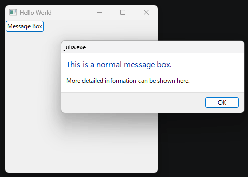

# julia libui test



## Run

```bash
$ julia --project=@. -e 'using Pkg; Pkg.instantiate()'
$ julia --project=@. -e 'using LibUiTest; LibUiTest.main()'

# on linux:
LD_LIBRARY_PATH=. julia --project=@. -e 'using LibUiTest; LibUiTest.main()'

# on mac:
DYLD_LIBRARY_PATH=. julia --project=@. -e 'using LibUiTest; LibUiTest.main()'
```

## Compile standalone executable

NOTE: This takes minutes. Be patient.

```bash
$ julia --project=@. -e 'using Pkg; Pkg.add("PackageCompiler")'
$ julia --project=@. -e 'using PackageCompiler; create_app(".", "build", force=true, incremental=true)'

$ ./build/bin/LibUiTest

# on linux:
LD_LIBRARY_PATH=. ./build/bin/LibUiTest

# on mac:
DYLD_LIBRARY_PATH=. ./build/bin/LibUiTest
```
